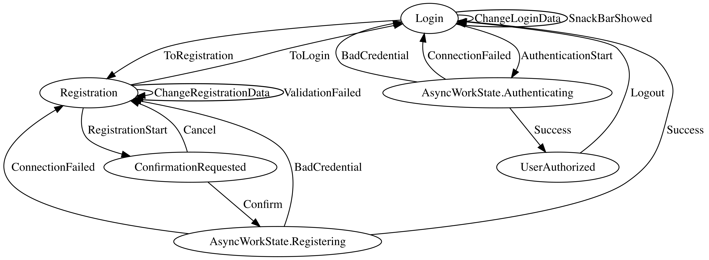

## Sample of usage VisualFSM for Command Line Interface application

ENG | [RUS](docs/README-RU.md)

[VisualFSM](https://github.com/Kontur-Mobile/VisualFSM) is a Kotlin library for **FSM**'s (`Finite-state machine`)[[1]](#what-is-fsm) and a set of tools for visualization and analysis of
 diagram of states.

The graph is being built from source code of **FSM**'s implementation. There is no need of custom
written configurations for **FSM**, you can just create new State and Action classes, they would be
automatically added to the graph of States and Transitions.

Source code analysis and the graph built are being performed with reflection and declared as a
separate module that would allow it to be connected to testing environment.

### Authorization and registration process

With Kotlin Coroutines: [cli-sample](./cli-sample)

With RxJava: [cli-sample-rx](./cli-sample-rx)

Generate digraph and tests sample: [AuthFSMTests.kt](./cli-sample/src/test/kotlin/ru/kontur/mobile/visualfsm/AuthFSMTests.kt)

For CI visualization use [graphviz](https://graphviz.org/doc/info/command.html), for the local visualization (on your
PC) use [webgraphviz](http://www.webgraphviz.com/).

### What is FSM

A `finite-state machine` (FSM) is an abstract machine that can be in exactly one of a finite number
of states at any given time. The `FSM` can change from one state to another in response to some
inputs.

[More on wikipedia](https://en.wikipedia.org/wiki/Finite-state_machine)