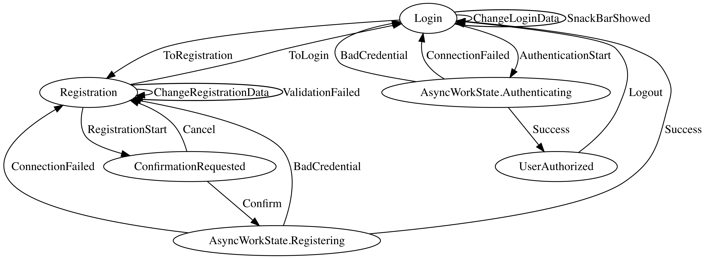

## Пример использования VisualFSM в Command Line Interface приложении

[ENG](../README.md) | RUS

[VisualFSM](https://github.com/Kontur-Mobile/VisualFSM) – это Kotlin-библиотека для реализации  **конечных автоматов** (`Finite-state machine`, далее FSM)[[1]](#что-такое-fsm) и набор инструментов для визуализации и анализа диаграммы
состояний.

Визуализация происходит по исходному коду реализации FSM. Не требует написания отдельных
конфигураторов для FSM, достаточно добавлять новые классы `State` и `Action` – они автоматически
добавятся в граф состояний и переходов FSM.

Анализ исходного кода и построение графа выполняется с помощью рефлексии и реализован отдельным
модулем, что позволяет подключить его только к тестовой среде.

### Процесс авторизации и регистрации пользователя

Kotlin Coroutines версия: [cli-sample](../cli-sample)

RxJava версия: [cli-sample-rx](../cli-sample-rx)

Генерация графа и пример тестов: [AuthFSMTests.kt](../cli-sample/src/test/kotlin/ru/kontur/mobile/visualfsm/AuthFSMTests.kt)

Для визуализации на CI используйте утилиту [graphviz](https://graphviz.org/doc/info/command.html), для визуализации на компьютере разработчика используйте [webgraphviz](http://www.webgraphviz.com/).

### Что такое FSM

`FSM` — это абстрактная сущность, которая может находиться только в одном из конечного количества
состояний в определённый момент. Она может переходить из одного состояния в другой в ответ на
входные данные.

[Подробнее на wikipedia](https://en.wikipedia.org/wiki/Finite-state_machine)